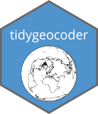

```{r notes, eval = F, include=FALSE}
Steps to prepare for rendering in Jekyll:

1. comment out `source(here::here("rmd_config.R"))` below
2. Knit with:
  
  output: html_document

   (this generates the HTML content for the leaflet map that we need)
3. uncomment the source() line from step 1
4. Knit a second time with this output statement

output: 
  md_document:
    pandoc_args: ["--wrap=none"]
    variant: gfm
    preserve_yaml: TRUE 
    
5. Find the Leaflet html content <div>...</div><script>...</script> content and paste it into the .md file.
6. Delete the .html file
```

```{r setup, include=FALSE}
source(here::here("rmd_config.R"))

knitr::opts_chunk$set(
  fig.width = 8,
  fig.height = 5,
  fig.align = 'center'
)
``` 

[Tidygeocoder v1.0.0](https://jessecambon.github.io/tidygeocoder/index.html) is now live on CRAN. There are numerous new features and improvements such as batch geocoding (submitting multiple addresses per query), returning full results from geocoder services (not just latitude and longitude), address component arguments (city, country, etc.), query customization, and reduced package dependencies.

For a full list of new features and improvements refer to the [release page on Github](https://github.com/jessecambon/tidygeocoder/releases/tag/v1.0.0). For usage examples you can reference the [Getting Started vignette](https://jessecambon.github.io/tidygeocoder/articles/tidygeocoder.html).

```{r echo=FALSE}

```

To demonstrate a few of the new capabilities of this package, I decided to make a map of the stadiums for the [UEFA Champions League Round of 16 clubs](https://www.uefa.com/uefachampionsleague/draws/2020/2001141/). To start, I looked up the addresses for the stadiums and put them in a dataframe.

```{r, message = FALSE, warning = FALSE}
library(dplyr)
library(tidygeocoder)
library(ggplot2)
require(maps)
library(ggrepel)

# https://www.uefa.com/uefachampionsleague/clubs/
stadiums <- tibble::tribble(
~Club,                ~Street,   ~City,   ~Country,
"Barcelona",          "Camp Nou", "Barcelona", "Spain",
"Bayern Munich",      "Allianz Arena", "Munich", "Germany",
"Chelsea",            "Stamford Bridge", "London", "UK",
"Borussia Dortmund",  "Signal Iduna Park", "Dortmund", "Germany",
"Juventus",           "Allianz Stadium", "Turin", "Italy",
"Liverpool",          "Anfield", "Liverpool", "UK",
"Olympique Lyonnais", "Groupama Stadium", "Lyon", "France",
"Man. City",          "Etihad Stadium", "Manchester", "UK",
"Napoli",             "San Paolo Stadium", "Naples", "Italy",
"Real Madrid",        "Santiago Bernabéu Stadium", "Madrid", "Spain",
"Tottenham",          "Tottenham Hotspur Stadium", "London", "UK",
"Valencia",           "Av. de Suècia, s/n, 46010", "Valencia", "Spain",
"Atalanta",           "Gewiss Stadium", "Bergamo", "Italy",
"Atlético Madrid",    "Estadio Metropolitano", "Madrid", "Spain",
"RB Leipzig",         "Red Bull Arena", "Leipzig", "Germany",
"PSG",                "Le Parc des Princes", "Paris", "France"
  )
```

To geocode these addresses, you can use the [geocode](https://jessecambon.github.io/tidygeocoder/reference/geocode.html) function as shown below. New in v1.0.0, the `street`, `city`, and `country` arguments specify the address. The Nominatim (OSM) geocoder is selected with the `method` argument. Additionally, the `full_results` and `custom_query` arguments (also new in v1.0.0) are used to return the full geocoder results and set [Nominatim's "extratags" parameter](https://nominatim.org/release-docs/develop/api/Search/#parameters) which returns extra columns. 

```{r}
stadium_locations <- stadiums %>%
  geocode(street = Street, city = City, country = Country, method = 'osm', 
          full_results = TRUE, custom_query= list(extratags = 1))
```

This returns `r ncol(stadium_locations)` columns including the longitude and latitude. A few of the columns returned due to the `extratags` argument are shown below.

```{r}
stadium_locations %>%
  select(Club, City, Country, extratags.sport, extratags.capacity, extratags.operator, extratags.wikipedia) %>%
  rename_with(~gsub('extratags.', '', .)) %>%
  knitr::kable()
```

Below, the stadium locations are plotted on a map of Europe using the longitude and latitude coordinates and ggplot.

```{r}
ggplot(stadium_locations, aes(x = long, y = lat)) +
  borders("world", xlim = c(-10, 10), ylim = c(40, 55)) +
  geom_label_repel(aes(label = Club), force = 2, segment.alpha = 0) +
  geom_point() +
  theme_void()
```

Alternatively, an interactive map can be created with the [leaflet](https://rstudio.github.io/leaflet/) library:

```{r}
library(leaflet)

stadium_locations %>% # Our dataset
  leaflet(width = "100%", options = leafletOptions(attributionControl = FALSE)) %>%
  setView(lng = mean(stadium_locations$long), lat = mean(stadium_locations$lat), zoom = 5) %>%
  # Map Backgrounds
  addProviderTiles(providers$Stamen.Terrain, group = "Terrain") %>%
  addProviderTiles(providers$NASAGIBS.ViirsEarthAtNight2012, group = "Night") %>%
  addProviderTiles(providers$Stamen.Toner, group = "Stamen") %>%
  addTiles(group = "OSM") %>%
  # Add Markers
  addMarkers(
    labelOptions = labelOptions(noHide = F), lng = ~long, lat = ~lat,
    clusterOptions = markerClusterOptions(maxClusterRadius = 10), label = ~Club,
    group = "Stadiums"
  ) %>%
  # Map Control Options
  addLayersControl(
    baseGroups = c("OSM", "Stamen", "Terrain", "Night"),
    overlayGroups = c("Stadiums"),
    options = layersControlOptions(collapsed = TRUE)
  )
```

If you find any issues with the package or have ideas on how to improve it, feel free to [file an issue on Github](https://github.com/jessecambon/tidygeocoder/issues). For reference, the RMarkdown file that generated this blog post can be found [here](https://github.com/jessecambon/jessecambon.github.io/tree/master/_posts/2020-07-15-tidygeocoder-1-0-0.Rmd).
