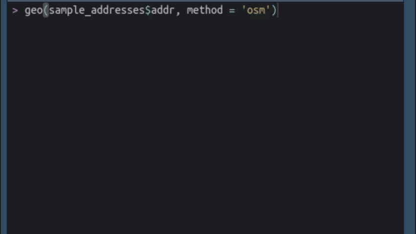

```{r setup, include = FALSE}
source(here::here("rmd_config.R"))

knitr::opts_chunk$set(
  fig.width = 8,
  fig.height = 5,
  fig.align = 'center'
)
```

[Tidygeocoder v1.0.4](https://jessecambon.github.io/tidygeocoder/) is released! 🍾 This release adds support for the [Geoapify geocoding service](https://www.geoapify.com/geocoding-api) (thanks [Daniel Possenriede](https://github.com/dpprdan)!), a progress bar, more helpful console output, and new functions for combining the results of multiple geocoding queries. A more detailed overview of the changes in this release is available in the [changelog](https://jessecambon.github.io/tidygeocoder/news/index.html).

### Progress Bars and Console Output

Progress bars are now displayed for single input geocoding queries (ie. not batch queries). Additionally, console messages now by default show which geocoding service was used, how many addresses or coordinates were given to it, and how long the query took to execute.

```{r, echo = FALSE, out.width = "70%"}

```

The `progress_bar` parameter can be used to toggle the use of the progress bar while the `quiet` parameter can be used to silence console messages that are displayed by default. See the documentation for [geo()](https://jessecambon.github.io/tidygeocoder/reference/geo.html) or [reverse_geo()](https://jessecambon.github.io/tidygeocoder/reference/reverse_geo.html) for details.

Additionally, the `quiet`, `progress_bar`, and `verbose` parameters can now be set permanently via `options()`. For example, `options(tidygeocoder.progress_bar = FALSE)` will disable progress bars for all queries.

### Combining Multiple Queries

In past releases of the package, `method = "cascade"` could be used in the `geo()` and `geocode()` functions to combine the results of geocoding queries from two different services. The "cascade" method is now deprecated in favor of two new and more flexible functions: `geocode_combine()` and `geo_combine()`. These functions allow for executing and combining the results of more than two queries and they allow the queries to be fully customized.

To demonstrate the utility of these new functions, below I've assembled a dataset of addresses to be geocoded. The first 5 are street level addresses in the United States that can be geocoded with the US Census geocoding service. However, three of these addresses will not return results with the US Census *batch* service (see [issue #87](https://github.com/jessecambon/tidygeocoder/issues/87) for more information) and must instead be geocoded with the US Census single address geocoder. Also, the last three addresses are cities outside the United States and require a different geocoding service entirely (the US Census service is limited to the United States).

```{r, message = FALSE}
library(tidyverse)
library(tidygeocoder)

mixed_addresses <- tribble(
  ~street_address, ~city, ~state_cd, ~zip_cd,
  "624 W DAVIS ST #1D",   "BURLINGTON", "NC",  27215,
  "201 E CENTER ST #268", "MEBANE",     "NC",  27302,
  "7833  WOLFE LN",       "SNOW CAMP",  "NC",  27349,
  "202 C St",             "San Diego",  "CA",  92101,
  "121 N Rouse Ave",      "Bozeman",    "MT",  59715
) %>%
  bind_rows(
    tibble(city = c('Taipei', 'Moscow', 'Buenos Aires'))
  )
```

If we wanted to geocode a large dataset with addresses such as these, we might first try to geocode as many as possible via the US Census batch service, then attempt the remaining addresses with the US Census single address geocoder, and then finally send any remaining unfound addresses to another service. We'll accomplish this workflow in the code below.

The `geocode_combine()` function accepts a dataframe input and a list of queries provided as lists (ie. a list of lists). Each list in the `queries` argument contains parameters that are passed to the `geocode()` function. Optionally, the `query_names` argument can be used to specify a label to be used for each query's results. 

Below, the `street`, `city`, `state`, and `postalcode` arguments are specified for the first two queries while the `address` argument (ie. single line address) is pointed at the `city` column for the third query (the ArcGIS service only accepts a single line address argument and doesn't use address component arguments like `city` and `state`). 

```{r}
results <- mixed_addresses %>%
  geocode_combine(
    queries = list(
      list(method = 'census', mode = 'batch', 
        street = 'street_address', city = 'city', state = 'state_cd', postalcode = 'zip_cd'),
      list(method = 'census', mode = 'single',
           street = 'street_address', city = 'city', state = 'state_cd', postalcode = 'zip_cd'),
      list(method = 'arcgis', address = 'city')
    ),
    query_names = c('census - batch', 'census - single', 'arcgis')
  )
```

```{r, echo = FALSE}
knitr::kable(results)
```

By default the results of the queries are combined into a single dataframe as shown above and the `query` column shows which query produced each result. Alternatively, the results of each query can be returned as separate dataframes in a list by using `return_list = TRUE`. 

By default, only addresses that are not found in a query are passed to the subsequent query. However, setting `cascade = FALSE` will pass all addresses to all queries. See [the documentation for the geocode_combine() function](https://jessecambon.github.io/tidygeocoder/reference/geocode_combine.html) for more usage details.

### Package Housekeeping

The `return_type`, `geocodio_v`, `mapbox_permanent`, `mapquest_open`, `iq_region`, and `here_request_id` parameters are now *deprecated* in favor of the new `api_options` parameter. For instance, instead of using `return_type = "geographies"` you should now instead use `api_options = list(census_return_type = "geographies")`. 

Also, the `cascade_order`, `param_error`, and `batch_limit_error` parameters in `geo()` are now deprecated as they were only required because of the deprecated "cascade" method. Refer to the documentation for [geo()](https://jessecambon.github.io/tidygeocoder/reference/geo.html) or [reverse_geo()](https://jessecambon.github.io/tidygeocoder/reference/reverse_geo.html) for details.