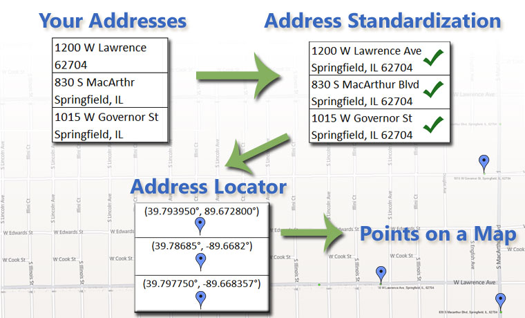
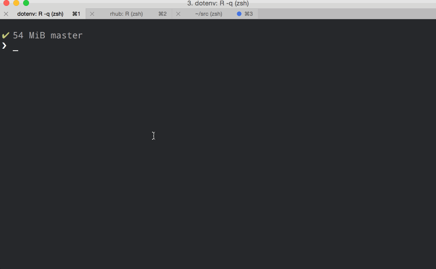
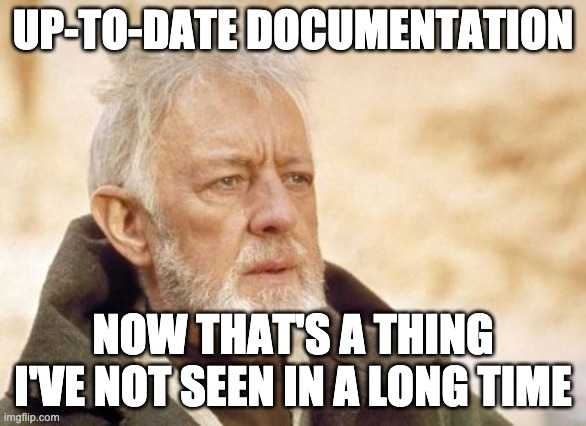
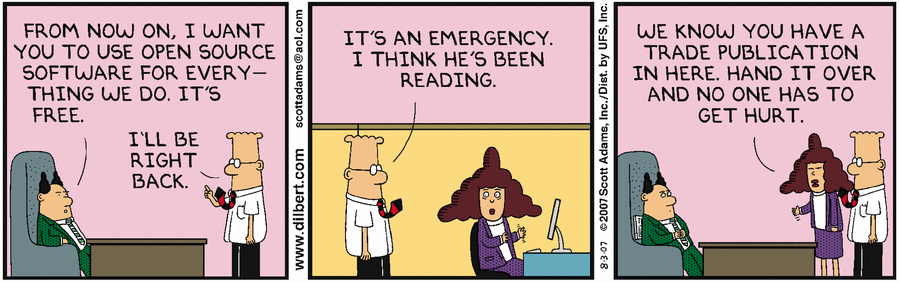

class: inverse, center, middle

<!--

## Xaringan References
* https://bookdown.org/yihui/rmarkdown/xaringan.html
* https://slides.yihui.org/xaringan/#1
* https://garthtarr.github.io/sydney_xaringan/#1
* https://github.com/garthtarr/sydney_xaringan
* http://svmiller.com/blog/2018/02/r-markdown-xaringan-theme/ 

-->

```{r setup, include=FALSE}
library(tidyverse)
library(glue)
library(knitr)
library(dplyr)
library(tidygeocoder)
library(DT)
library(leaflet)
library(leaflet.extras)

knitr::opts_chunk$set(echo = FALSE,warning = FALSE,
    message = FALSE, fig.width = 10.25, fig.height = 6)

# Custom CSS for my slides 
# https://pkg.garrickadenbuie.com/xaringanthemer/articles/xaringanthemer.html
custom_styles <- list(
  # this is for the code that overflows on the slides (vertically)
  ".scroll-output" = list("max-height" = "480px", 
                      "overflow-y" = "scroll",
                      "overflow-x" = 'hide'))

xaringanthemer::style_xaringan(
      base_font_size = '16px',
      title_slide_background_image = 'images/tidygeocoder_hex.png',
      title_slide_text_color = 'white',
      title_slide_background_size = '25%',
      title_slide_background_position = "50% 85%",
      extra_css = custom_styles)

# used by knitr::include_url() function
url_frame_height <- '480px' 
```


# Introduction
---


## What I'll Talk About

.pull-left[

- A brief intro to the R ecosystem

- How geocoding services are used

- The creation and publishing of **tidygeocoder**, an open source R package for geocoding.
  - The package was originally published in October 2019. 
  - A new overhauled version was published in July 2020. 

- Lessons learned from developing an open source package

]

.pull-right[
```{r}

```
]
---

## The R Ecosystem

.pull-left[
- **R** is an open source programming language for data analysis

- Commonly used in many quantitative fields such as statistics, public health, and data journalism
  
- Strong community on Twitter, [R-Bloggers.org](https://www.r-bloggers.com/), and [RWeekly.org](https://rweekly.org/)

- **Packages** provide code and functions that extend R's capabilities. 

- There are over 16,000 R packages available on **CRAN**, R's official package database. 

- Powerful and intuitive data analysis, visualization, and modeling workflows with **tidyverse** and **tidymodels**.

- **RMarkdown** can create all kinds of documents directly from code such as websites, books, and this presentation.
]

.pull-right[

```{r}
include_graphics('images/bbc-r-plots.png')
```

```{r}
include_graphics('images/rayshader_smallhobart.gif')
```
]

???
Top right: BBC charts
Bottom right: Rayshader package


- [Source for Number of Packages](https://cran.r-project.org/web/packages/)
- [https://bbc.github.io/rcookbook/](BBC R Cookbook)

---

## The "Tidy" Philosophy


- [**Tidy data**. The Journal of Statistical Software, vol. 59, 2014](https://vita.had.co.nz/papers/tidy-data.html) by **Hadley Wickham**, Chief Data Scientist at RStudio

> Tidy datasets are easy to manipulate, model and visualize, and have a specific structure: each variable is a column, each observation is a row, and each type of observational unit is a table. 

--

.center[
```{r} 
# use dpi to resize images
custom_dpi <- 260

include_graphics('images/tidyverse.png', dpi = custom_dpi)
include_graphics('images/tidymodels.png', dpi = custom_dpi)
include_graphics('images/tidyposterior.png', dpi = custom_dpi)
include_graphics('images/tibble.png', dpi = custom_dpi)
include_graphics('images/dplyr.png', dpi = custom_dpi)
include_graphics('images/tidyr.png', dpi = custom_dpi)
include_graphics('images/broom.png', dpi = custom_dpi)
```
]

Two collections of packages:

- **Tidyverse** is a collection of packages for data manipulation and visualization (includes ggplot and dplyr).

- **Tidymodels** is a collection of packages for statistical modeling and machine learning.

- Both of these projects are primarily backed by **RStudio**.

--

---

## CRAN - The R Package Repository

.pull-left[

- CRAN = **C**omprehensive **R** **A**rchive **N**etwork

- To get a package hosted on **CRAN**, it goes through an approval process

- All packages are automatically tested on different platforms (Linux, Windows, Mac) when submitted

- New packages go through manual human review

- Packages are checked for adherence to [CRAN policies](https://cran.r-project.org/web/packages/policies.html) including license formatting, documentation standards, and folder structure

]

.pull-right[
```{r}

```
]

???

Image source: https://r-coder.com/install-r-packages/ 

---

## How to Create an R Package

.pull-left[

- Create a **DESCRIPTION** file which has key info about your package

- Put **R code** for your package in .R files under a folder named "R". Code documentation is written inline.

- Use the **devtools** package to test, build, and install your package

- For easy distribution, host your package on **Github** and submit it to **CRAN**

- Refer to ["R Packages" by Hadley Wickham and Jennifer Bryan](https://r-pkgs.org/) for details

- **Tip**: Use other CRAN packages on Github as a reference for how to format and structure your package

]

.pull-right[
```{r}
include_graphics('images/rpackages_cover.png')
```
]

???

https://r-pkgs.org/intro.html

---
class: inverse, center, middle
# Geocoding Services
---

## Maps

```{r, warning=F, message=F}
# Note: ~ character tells leaflet to look for variables in the dataset
# https://github.com/Leaflet/Leaflet.markercluster
# https://stackoverflow.com/questions/37996143/r-leaflet-zoom-control-level
# https://stackoverflow.com/questions/56069708/leaflet-cluster-marker-spacing-or-how-to-have-smaller-groups-when-zoomed-out

volcano_icon <- leaflet::makeIcon("images/icons8-volcano-50.png", iconWidth = 30, iconHeight = 30)

# Volcano data from Tidy Tuesday
volcanoes_tt <- readr::read_csv('https://raw.githubusercontent.com/rfordatascience/tidytuesday/master/data/2020/2020-05-12/volcano.csv')

# Create lables for Volcanoes
volcanoes_info <- 
  volcanoes_tt %>%
  mutate(last_eruption_year_label = case_when(
        last_eruption_year=='Unknown' ~ last_eruption_year,
        str_sub(last_eruption_year, 1 ,1) == "-" ~ str_c(str_sub(last_eruption_year,2),' BC'),
        TRUE ~ str_c(last_eruption_year, ' AD')
        ),
      label = glue("<b>{volcano_name}</b></br>Last Eruption: {last_eruption_year_label}")
      ) 

volcanoes_info %>% # Our dataset
  leaflet(width="100%") %>%
  setView(lng = mean(volcanoes_info$longitude), lat = mean(volcanoes_info$latitude), zoom=2) %>%
  # Map Backgrounds
  addProviderTiles(providers$Esri.NatGeoWorldMap, group='ESRI') %>% 
  addProviderTiles(providers$Stamen.Terrain, group='Terrain') %>%
  addProviderTiles(providers$NASAGIBS.ViirsEarthAtNight2012, group='Night') %>%
  addProviderTiles(providers$Stamen.Toner, group='Stamen') %>%
  addTiles(group = "OSM") %>%
  addProviderTiles(providers$Esri.WorldTopoMap, group="Topo") %>%
  # Add Eruption Markers
  addMarkers(labelOptions = labelOptions(noHide = F),
       clusterOptions = markerClusterOptions(maxClusterRadius = 40),
       icon=volcano_icon, label= ~map(label,htmltools::HTML),
       group="Eruptions") %>%
  # Map Control Options
  addLayersControl(baseGroups = c("ESRI","OSM","Stamen","Terrain","Topo","Night"),
       overlayGroups=c('Eruptions'),
       options = layersControlOptions(collapsed = TRUE)) %>%
  addFullscreenControl()
```

Created with [Leaflet](https://rstudio.github.io/leaflet/). Data from ["Tidy Tuesday"](https://github.com/rfordatascience/tidytuesday/blob/master/data/2020/2020-05-12/readme.md). <a target="_blank" href="https://icons8.com/icons/set/volcano">Volcano icon </a>by <a target="_blank" href="https://icons8.com">Icons8</a>

---

## Geocoding 

.pull-left[

- Longitude and latitude coordinates are needed for mapping and geospatial analysis.

- **Geocoding** is the process of getting data such as latitude and longitude for addresses.

- Addresses are submitted to geocoder services via HTTP requests. Data is often returned in JSON format.

- Some services offer **batch geocoding** which allows multiple addresses to be submitted in a single query.

- Try it out with [OpenStreetMap.org (Nominatim)](https://www.openstreetmap.org/) 

]

.pull-right[

```{r}
 
```
]

???

Image Source: https://www.geospatialworld.net/blogs/what-is-geocoding-and-how-can-it-help-sell-products/ 

Nominatim Washington Monument Lookup: https://www.openstreetmap.org/relation/3374540#map=17/38.88943/-77.03251

---

## Geocoder Queries - Nominatim (OSM)

- **Nominatim** is an open source geocoder service for the OpenStreetMap (OSM) database. It has a 1 request per second usage limitation. 

- The **httr** package is used to execute the HTTP query to the API. 

- The **jsonlite** and **httr** packages are used to format the json (text) format response from the API as a data frame.

```{r, echo = TRUE}
osm_response <- httr::GET(
  url = "http://nominatim.openstreetmap.org/search", 
  query = list(q = 'Tokyo, Japan', format = 'json', limit = 1))

osm_results <- jsonlite::fromJSON(
  httr::content(osm_response, as = 'text', encoding = "UTF-8"))
```

```{r}
gt::gt(osm_results)
```

---

## Geocoder Queries - Census

- The US Census geocoder service is limited to the United States and can only geocode street level addresses. However, it has no usage restrictions.

```{r, echo = TRUE}
census_response <- httr::GET(
  url = "https://geocoding.geo.census.gov/geocoder/locations/onelineaddress", 
  query = list(address = "1600 Pennsylvania Ave, Washington, DC",
  format = 'json', benchmark = 'Public_AR_Current'))

census_raw <- jsonlite::fromJSON(httr::content(census_response, 
                as = 'text', encoding = "UTF-8"))

census_results <- jsonlite::flatten(census_raw$result$addressMatches)
```

```{r}
gt::gt(census_results)
```

---

## Batch Geocoding - Census

- The Census service allows up to 10,000 addresses to be submitted at once via batch geocoding.

.scroll-output[
```{r, echo = TRUE}
# column names for what the census batch geocoder returns
return_cols <- c('id', 'input_address', 'match_indicator', 'match_type', 
  'matched_address', 'coords', 'tiger_line_id', 'tiger_side')

# Format input data
input_df <- tibble::tibble(
  id = 1:50,
  street = louisville$street,
  city = louisville$city,
  state = louisville$state,
  zip = louisville$zip,
)

# Prepare temp CSV file for upload
tmp <- tempfile(fileext = '.csv')
utils::write.table(input_df, tmp, row.names = FALSE, 
                   col.names = FALSE, sep = ',', na = '', 
                   qmethod = 'double', fileEncoding = "UTF-8")

# Upload CSV file via HTTP POST request
req <- httr::POST(
 "https://geocoding.geo.census.gov/geocoder/locations/addressbatch",
   body = list(
     addressFile = httr::upload_file(tmp),
     benchmark = 'Public_AR_Current',
     format = 'json',
     vintage = 'Current_Current'
   ),
   encode = 'multipart',
   httr::timeout(60)
  )

# Parse response data
cnt <- httr::content(req, as = 'text', encoding = "ISO-8859-1")
batch_results <- utils::read.csv(text = cnt, header = FALSE,
    col.names = return_cols, fill = TRUE, 
    stringsAsFactors = FALSE, na.strings = '')
# reorder by id column
batch_results <- batch_results[order(batch_results['id']), ] 
```
]

---

## Batch Geocoding - Results

```{r}
batch_results %>% head(4) %>% gt::gt(.)
```

---

## Why a New R Package for Geocoding?

</br>

**The Problem: Geocoding can be unintuitive and time consuming**

- API parameters, capabilities, and data formats vary between geocoding services.

- Existing R packages for geocoding often only support a single service.

- Significant data manipulation can be required when geocoding, especially when working with multiple packages and services.

</br>

**The Goal: Create an R Package that makes geocoding easy**

- Provide an intuitive unified interface for using multiple geocoding services.

- Provide the data from geocoding services in a standard dataframe format for ease of use.

- Integrate seamlessly into existing tidyverse data pipelines.

---
class: inverse, center, middle
# Tidygeocoder - The First Release
---

## The First Release

.pull-left[
- Initial release of tidygeocoder was in October 2019.

- It took several submissions to CRAN before it was accepted.

- Could use either Census or Nominatim (OSM) geocoder services.

- The OSM geocoder was implemented using the **tmaptools** package (more on this package later).

- Latitude and longitude were returned in dataframe format.
]

.pull-right[
```{r}

```
]
---

## Function Architecture

Three functions:

- **geo_census()** geocodes a single address using the Census geocoder.

- **geo_osm()** geocodes a single address with OSM (Nominatim) via the **tmaptools** package.

- **geocode()** takes a dataframe as an input and calls either `geo_census()` or `geo_osm()` in a loop to geocode multiple addresses.

<!-- For some reason only html center tags work with DiagrammeR (.center[] and fig.align='center' don't) -->
<center>
```{r, out.width = '70%'}
DiagrammeR::grViz("digraph function_calls {

      graph [layout = dot]
      
      node [fontname = Helvetica, shape = egg, fixedsize = true, fillcolor = linen,
        width = 2, fontsize = 12, style = filled ]       
        
      geocode [label = 'geocode()']
      geo_census [label = 'geo_census()']
      geo_osm [label = 'geo_osm()']
      

      # edge definitions with the node IDs
      geocode -> { geo_census geo_osm };
      }
      ")
```
</center>
---

## Tidygeocoder - Demo

```{r, echo = FALSE}
knitr::include_url('https://jessecambon.github.io/2019/11/11/tidygeocoder-demo.html', height = url_frame_height)
```

---

background-image: url("images/GitHub-Logo.png")
background-position: 93% 5%
background-size: 110px

## Project Management - GitHub

- Use **issues** to track bugs and features

- Tag issues to commits to help track code changes

- Use **branches** to organize significant code alterations

- Create a **release** when a new version is accepted by CRAN

- Users can install experimental versions of your package from Github with `devtools::install_github()`

.center[
```{r}
include_graphics('images/dilbert_agile.gif')
```
]

---

## Problems in the Initial Release

.pull-left[
- **Installation errors** caused by package dependency issues (more on this later) 

- **Lack of batch geocoding** made it less useful for large volumes of addresses

- Nominatim (OSM) service sometimes blocked users because of API overuse

- **Only returns latitude and longitude**. Geocoder servers offer other data (Census geographies, building height, etc.)

- Limited ability to use customize API queries

- Could only use single line addresses
]

.pull-right[
```{r}

```
]

---
class: inverse, center, middle
# Redesigning Tidygeocoder
---

background-image: url("images/tidygeocoder_hex.png")
background-position: 93% 5%
background-size: 110px

## Tidygeocoder 1.0.0

- Released in July 2020.

- Code was modularized to more efficiently support multiple geocoder services

- Support was added for the commercial **Geocodio** and **Location IQ** geocoder services

- **Reduced package dependencies** to address installation problems (most of the package was rewritten in base R)

- **Batch geocoding** support was added for the US Census and Geocodio services

- Option to return the full geocoder service results (not just latitude and longitude)

- Increased flexibility in creating API queries

- Deduplication of address data


???

https://jessecambon.github.io/tidygeocoder/news/index.html 

---

## Tidygeocoder 1.0.0 - Demo

```{r, echo = FALSE}
knitr::include_url('https://jessecambon.github.io/2020/07/15/tidygeocoder-1-0-0.html', 
                   height = url_frame_height)
```

---

## New Function Architecture

- Two main functions: 
  - **geocode()** accepts a dataframe containing addresses
  - **geo()** accepts character values (addresses)
  
- Only unique addresses are submitted to geocoder services, but rows in the original dataset are preserved ("packaging" and "unpackaging" of addresses)
- A built-in dataframe is used to lookup API parameters for each geocoder service

```{r}
### Based on:
# pkgnet::CreatePackageReport('tidygeocoder')

## Documentation for DiagrammeR:
# https://mikeyharper.uk/flowcharts-in-r-using-diagrammer/
# https://rich-iannone.github.io/DiagrammeR/graphviz_and_mermaid.html

# Color options: https://graphviz.org/doc/info/colors.html

DiagrammeR::grViz("digraph function_calls {

      graph [layout = dot]
      
      node [fontname = Helvetica, shape = egg, fixedsize = true,
              style = filled, fillcolor = linen, width = 2, fontsize = 12 ]       
        
      geo [label = 'geo()']
      geocode [label = 'geocode()']
      package_addresses [label = 'Package Addresses']
      build_query [label = 'Build API\nQuery Parameters']
      query_api [label = 'Executive API Query']
      extract_results [label = 'Extract Query Results']
      unpackage_addresses [label = 'Unpackage Addresses']
      

      # edge definitions with the node IDs
      geocode -> geo;
      geo -> {package_addresses build_query query_api extract_results unpackage_addresses};
      }
      ")
```

---

## API Standardization

- The package architecture was structured to make it easier to implement multiple geocoder services

- A central `api_parameter_reference` dataframe houses the cross-reference for universal and API-specific parameter names.

```{r}
api_parameter_reference %>% 
   select(-required) %>%
   mutate(across(c(method, generic_name, api_name), as.factor)) %>%
   datatable(rownames = FALSE, 
          options = list(lengthMenu = c(6), pageLength = 6))
```

---

## Dependencies

.center[
```{r}
include_graphics('images/open_source_jenga.png', dpi = 100)
```
]
.center[https://xkcd.com/2347/]

---

## Dependencies - Initial Release

.center[
```{r}
## Created graph on Ubuntu system by installing the original version of the package (0.2.4)
# devtools::install_version("tidygeocoder", version = "0.2.4", repos = "http://cran.us.r-project.org")
## NOTE: installed cran packages only (2)
# dd_local <- deepdep::deepdep("tidygeocoder", depth = 3, local = TRUE)
# local_deedep_plot <- deepdep::plot_dependencies(dd_local, "circular")
include_graphics('images/tidygeocoder_old_dependencies.png', dpi = 105)
```
]

---

## Dependencies - Current Version

.center[
```{r, fig.width = 12, fig.height = 7.9, dpi = 75}
dd_2 <- deepdep::deepdep("tidygeocoder", depth = 3)
deepdep::plot_dependencies(dd_2, "circular")
```
]

---

background-image: url("images/devtools-logo.svg")
background-position: 93% 5%
background-size: 110px

## Testing

.pull-left[
- You can include automated tests within your R package (in the "tests" directory)

- The **rhub** package uploads your package to servers which test it on multiple platforms (Linux/Mac/Windows)

- You can test your package locally or with rhub using the **devtools** package

- Because tidygeocoder uses external web services that can experience downtime, I opted for more minimal built-in tests.

]

.pull-right[
</br></br></br>
```{r}

```
]

???

Documentation of tests performed: https://github.com/jessecambon/tidygeocoder/blob/master/cran-comments.md 

---

background-image: url("images/pkgdown.png")
background-position: 93% 5%
background-size: 110px

## Creating a Documentation Website

- The **pkgdown** package builds a static HTML website

- Requires minimal configuration and can be hosted for free on Github pages

- Your Github **README.md** becomes the home page of the site

- In-built package documentation is used to populate the website

- Search capabilities can be added for free with [Algolia](https://pkgdown.r-lib.org/articles/search.html)

.center[
```{r, out.height = '300px'}

```
]
---

## The Package Website

```{r, echo = FALSE}
knitr::include_url('https://jessecambon.github.io/tidygeocoder/', 
                   height = url_frame_height)
```

---
class: inverse, center, middle
# Closing Thoughts
---

## Lessons Learned on Open Source Development

- **Start small:** if you have code that makes a common task easier, you might have the basis for a package

- **It's an iterative process:** open source packages are works in progress (to varying degrees)

- Getting **feedback** and seeing how people use your package is very valuable for making it better and for personal development

- It can be time consuming, but also rewarding and a great way to learn

- Open source projects are a great opportunity for organizations to earn technical street cred:
  - [**Facebook**](https://opensource.facebook.com/projects/): PyTorch, MaskRCNN, Prophet, React, Docusaurus
  - [**Google**](https://opensource.google/projects/list/featured): Android, Chromium, Angular, Kubernetes, CasualImpact

.center[
```{r}
 
```
]

???

